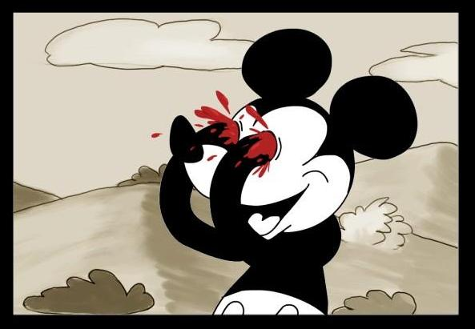

# hhco

## wtf

Figure out the rules and expected number of turns to win the terrible kids'
game "HiHo!  Cherry-O Mickey Mouse Clubhouse Edition"

[Don't buy.](http://www.amazon.com/Cherry-O-Disney-Mickey-Clubhouse-Edition/dp/B00IFWSO8K)

Why? Because the rules supplied are inscrutable, so the only rational path
forward is to write a simple simulation to test alternatives.

Said differently, I did this to answer the question **can this game really
take this long???**

## game

Each player starts with a tree with ten fruits on it.  The object of the game
is to move all your fruit to a picnic area.  You move fruit by spinning a wheel
and moving the prescribed number of fruit.

The spinner has seven equally likely spots, each dictating how many fruits to
move from the current player's tree to the picnic. Probably? There are many
interpretations of the spinner, but the least ridiculous one seems to be to
count the number of fruits on the spot, and ignore the numbers and colours.

One of the spots, "Pluto", causes all players to remove three fruits from the
picnic and put them back on their respective trees. Potentially? Or maybe it's
one fruit each for a total of three. Only God and Hasbro know for sure, though
I endeavour to find out.

Simple EV (in fruits moving from tree->picnic) of a spin is:
(1+1+2+2+3+3-3)/7 == 9/7 == 1.285714286 fruit/spin

For a 1 player game you might expect 10/(9/7) == 7.778 spins. Problem is that
negative valued spins before you have sufficient fruits at the picnic don't
hurt you as badly, so "experimentally" the expected number of spins to win a
single player game seems to be around 7.59:

    (hhco.core/-main 100000 1) ;7.58982

With three players, you've got more people rolling negatives and prolonging
the game. Expect the winner to take ~9.5 spins in this case.

    (hhco.core/-main 100000 3) ;9.49713

This is the number of spins for *the winner*, so for three players we're
looking at ~28.5 spins, which is an eternity for kids. From this I suspect the
Pluto rule is really each player puts one fruit back on the tree.  If that's
the case, the winner wins in ~6.14 turns:

    (hhco.core/-main 100000 3 -1) ;6.14403

This is moderately more tolerable.

I suspect the math for the exact solution to these questions might be easier
than I think, but I am terrible at probability and wanted to write a program,
which is guaranteed to be bug free.  If you happen to know how to get the exact
solution (i.e. without monte carlo methods), let me know!

